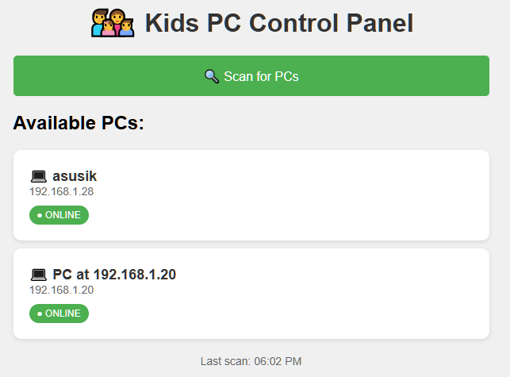

# Kid PC Monitor

DIY parental control system for parents who code. If you know what 'pip install' means, this is for you!


## 🎯 Features

- **📱 Control from your phone** - Web interface works on any device
- **🔒 Remote lock/unlock detection** - See if kids' PCs are locked
- **⏰ Scheduled bedtime locks** - Automatically lock at set times
- **⏱️ Daily usage limits** - Set maximum screen time
- **💬 Send messages** - Display warnings or reminders
- **🏠 Auto-discovery** - Finds all PCs on your network

## 📸 Screenshots



*Control multiple PCs from your phone*

## 🚀 Quick Start

## ⚠️ Technical Skills Required

This is NOT a one-click solution. You'll need to:
- Install Python
- Use command prompt
- Understand IP addresses  
- Configure Windows Firewall (technically you would simply allow the process to run - once)
- Set up scheduled task

If these terms scare you, consider commercial alternatives like:
- Qustodio
- Net Nanny
- Windows Family Safety

### Prerequisites
- Windows 10/11 PCs (for the kids)
- Python 3.7+ installed
- All PCs on the same network

### Installation

1. **On each kid's PC:**
```bash
# Download the control script
git clone https://github.com/rookie7799/kid-pc-monitor.git
cd kid-pc-monitor

# Install requirements
pip install -r requirements.txt

# Run the control script (as administrator)
python scripts/install.py
```
* side note - if your code is "good" with computers, I would recommend copying pc_monitor.py
 some place where it would be hard to find ;)

2. **On your phone/computer:**
```bash
# Run the web interface
cd src
python web_panel.py

# Open in browser
http://YOUR-PC-IP:5000
```

## 📖 Usage Guide

### Setting Up Daily Limits
1. Open the web interface on your phone
2. Click on a PC
3. Use quick buttons: "30 min", "1 hour", "2 hours"
4. Or set a custom time limit

### Setting Bedtime
1. Select a PC
2. Scroll to "Set Lock Time"
3. Choose bedtime (e.g., 9:00 PM)
4. PC will lock automatically

### Emergency Unlock
While remote unlock isn't possible for security, you can:
- Grant extra time before the lock
- Send a message to request unlock
- Restart the PC (if no password)

## ⚙️ Configuration

### Custom PC Names
Edit `src/web_panel.py`:
```python
CUSTOM_PC_NAMES = {
    '192.168.1.105': 'Tommy\'s Laptop',
    '192.168.1.112': 'Sarah\'s Desktop',
}
```


## 🔧 Troubleshooting

### "PC shows as Unknown"
- Add custom names in configuration
- Check Windows Firewall settings
- Ensure PCs are on same network

### "Can't connect from phone"
- Check firewall allows port 5000
- Use PC's IP address, not localhost
- Ensure web_control_panel.py is running

### "Lock status not updating"
- Restart pc_control.py
- Check if LogonUI.exe detection works
- See logs in console window

## 🛡️ Security Notes

- Only works on local network (not internet)
- No passwords stored
- Can't bypass Windows lock screen
- Kids can close if they have admin rights

## 🤝 Contributing

Parents and developers welcome! Please:
1. Fork the repository
2. Create a feature branch
3. Submit a pull request

### Ideas for Contributions
- macOS/Linux support
- Mobile app
- Usage statistics/reports
- Reward system integration
- Application-specific time limits

## 📄 License

MIT License - feel free to modify for your family's needs!

## ❤️ Acknowledgments

Created by parents, for parents. Special thanks to all contributors who help make screen time management easier!

---

**Need Help?** Open an [issue](https://github.com/rookie7799/kid-pc-monitor/issues) or check our [FAQ](docs/FAQ.md)
